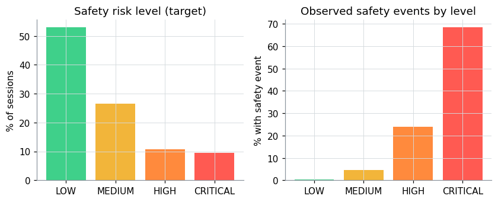
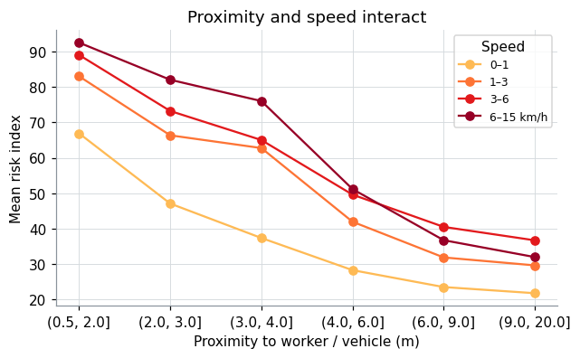
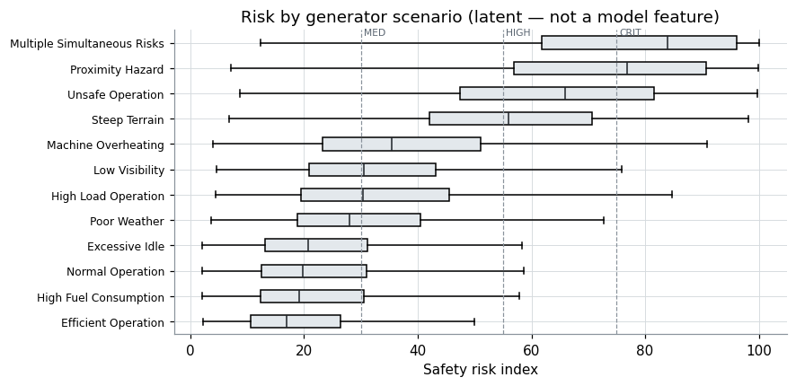
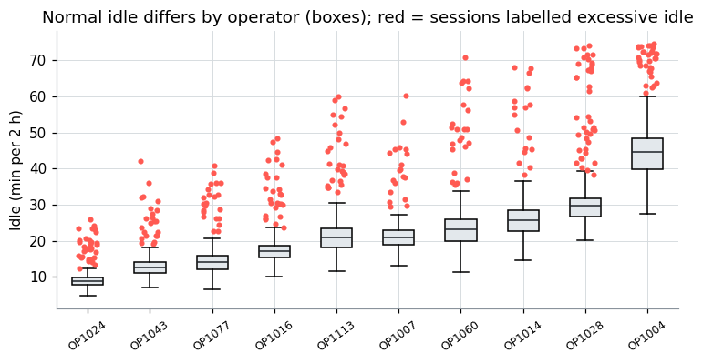
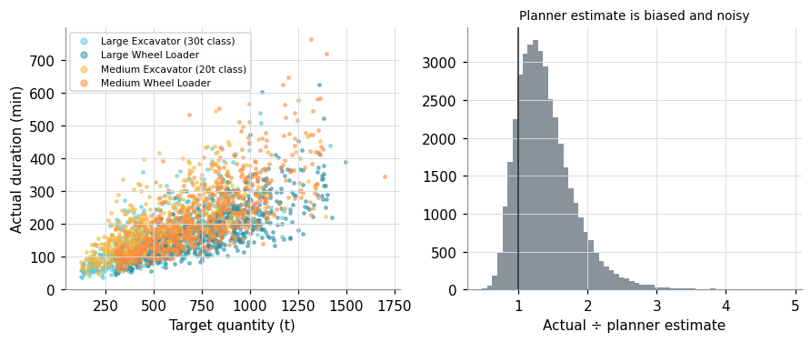
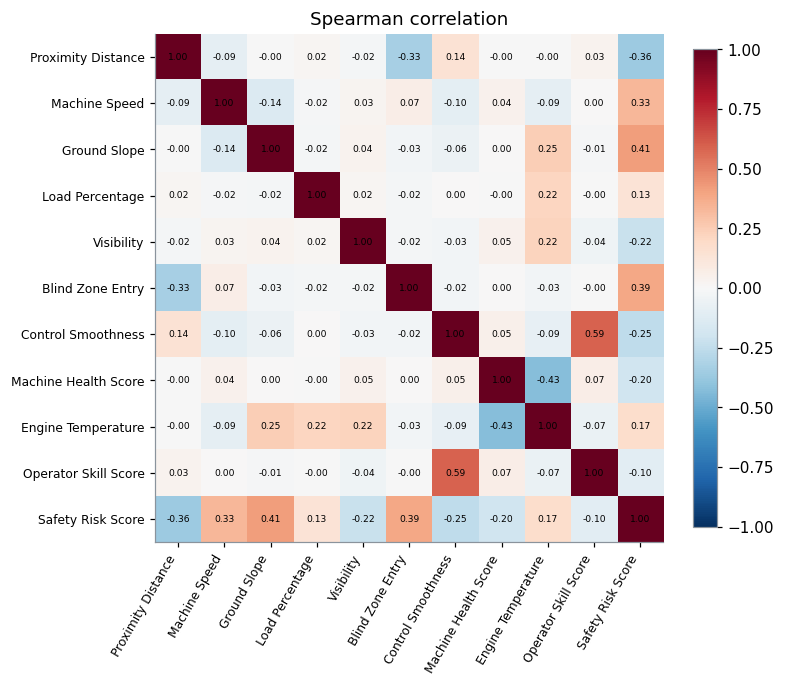

# Exploratory data analysis

> Synthetic prototype data — not real CAT telemetry. Generated by `python ml/eda.py`.

## 1. Target balance

| Level | Share | Safety-event rate |
|---|---|---|
| LOW | 53.0% | 0.3% |
| MEDIUM | 26.6% | 4.5% |
| HIGH | 10.8% | 23.9% |
| CRITICAL | 9.6% | 68.5% |

Classes are imbalanced (HIGH and CRITICAL ≈ 10 % each), so accuracy alone is misleading. Models are compared on macro-F1 and HIGH/CRITICAL recall, and trained with class weights.

## 2. Proximity × speed

Near a person (0.5–2 m) mean risk rises from 67 (stationary) to 93 (6–15 km/h); beyond 9 m the same speed change moves it only 22 → 32. The effect of speed depends on distance, so a purely additive model will underfit. Two remedies were compared in Phase 5: tree ensembles, and a linear model with explicit hazard-product terms (proximity × speed, slope × load, …). The linear model with interactions won on validation – see `ml_methodology.md` for why, and for the caveat.

## 3. Scenarios

Scenarios separate clearly in risk, but `Scenario` is a latent generator variable and is **never** a model input. It is used only to stratify error analysis.

## 4. Personal baselines (why the Digital Twin)

Operators' median normal idle ranges from 13 to 30 min per 2 h (10th–90th percentile of operators). 31% of sessions labelled *excessive idle* fall **below** the fleet-wide 90th percentile of normal idle — a global threshold would miss them. Behaviour must be compared with the operator's own baseline.

## 5. Task duration

Actual ÷ planner estimate: median 1.32, 10th–90th percentile 0.94–1.94. The planner ignores operator skill, terrain, weather and machine health, which the regression model can use.

## 6. Correlation

Strongest single-feature association with the risk index: Ground Slope (|ρ| 0.41), Blind Zone Entry (|ρ| 0.39), Proximity Distance (|ρ| 0.36), Machine Speed (|ρ| 0.33). No single feature exceeds |ρ| 0.5, i.e. risk emerges from combinations of factors.

## 7. Feature-engineering decisions

| Feature | Why |
|---|---|
| `Inv_Proximity` = 1 / distance | risk grows sharply as distance → 0; helps the linear baseline |
| `Person_Nearby` | a structure at 2 m is not a worker at 2 m |
| `Is_Reversing`, `Seatbelt_Off` | binary flags from categorical sensor states |
| `Harsh_Rate_per_h` | counts scale with duration; the rate is comparable across sessions (a rolling rate at run time) |
| `Remaining_Quantity`, `Planner_Remaining`, `Historical_Remaining` | progress-adjusted versions of known plan quantities for the remaining-time model |
| behaviour rates + context-expected speed / fuel | anomaly model compares behaviour to the operator's own baseline after removing terrain, load and machine-class effects |

Leakage exclusions per model are enforced in code (`ml/features.py` `*_FORBIDDEN`, asserted by tests).
