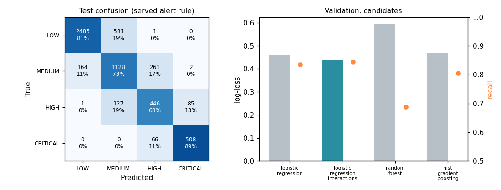
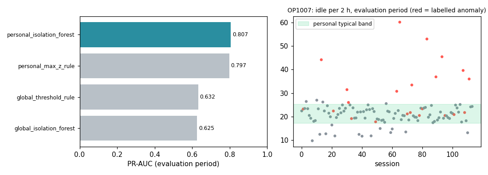
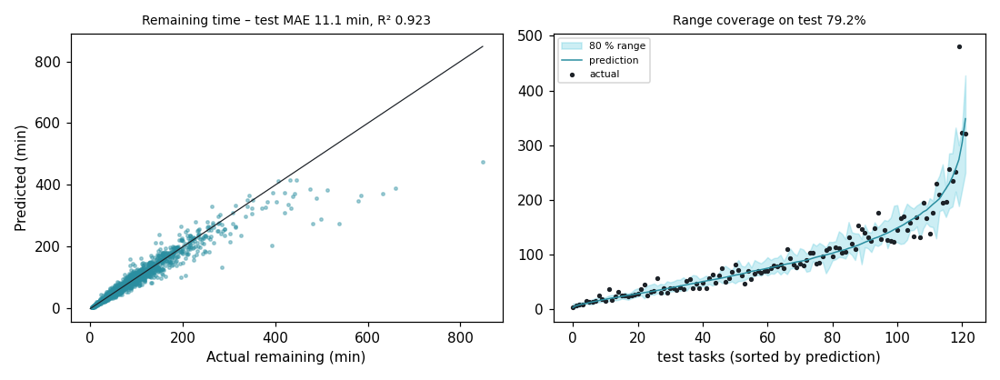

# Model evaluation report

> Generated from `models/*/metadata.json` by `python ml/evaluate_models.py`. All metrics are on **synthetic** data and do not indicate real-world performance.

## 1. Safety risk model

Selected **logistic_regression_interactions** (lowest validation log-loss). Split: operator-grouped 70/15/15 (seed 42); final model refit on train+val. Decision: level = band of score with alert thresholds [27.0, 52.0, 72.0] (label thresholds minus 3.0, chosen on validation for HIGH∪CRITICAL recall ≥ 0.9).

### Validation – candidates

| Candidate | Log-loss ↓ | Macro-F1 (argmax) | Fit (s) |
|---|---|---|---|
| logistic_regression | 0.463 | 0.745 | 0.7 |
| logistic_regression_interactions | 0.438 | 0.760 | 0.9 |
| random_forest | 0.595 | 0.673 | 19.0 |
| hist_gradient_boosting | 0.469 | 0.741 | 18.7 |

### Test – 5,855 sessions from unseen operators

| Metric | Value |
|---|---|
| Accuracy | 0.780 |
| Macro-F1 | 0.757 |
| ROC-AUC (one-vs-rest, macro) | 0.950 |
| Log-loss | 0.435 |
| HIGH ∪ CRITICAL recall | 0.896 |
| LOW sessions raised to MEDIUM+ (false alarm) | 0.190 |
| Under-predicted by ≥ 2 levels | 0.0002 |
| CRITICAL predicted LOW | 0 |
| Risk-score MAE vs ground-truth index (0–100) | 5.50 |

| Level | Precision | Recall | F1 | ROC-AUC |
|---|---|---|---|---|
| LOW | 0.938 | 0.810 | 0.869 | 0.964 |
| MEDIUM | 0.614 | 0.725 | 0.665 | 0.895 |
| HIGH | 0.576 | 0.677 | 0.622 | 0.946 |
| CRITICAL | 0.854 | 0.885 | 0.869 | 0.993 |

Confusion matrix (rows = true, columns = predicted, order LOW/MEDIUM/HIGH/CRITICAL):

|  | LOW | MEDIUM | HIGH | CRITICAL |
|---|---|---|---|---|
| LOW | 2485 | 581 | 1 | 0 |
| MEDIUM | 164 | 1128 | 261 | 2 |
| HIGH | 1 | 127 | 446 | 85 |
| CRITICAL | 0 | 0 | 66 | 508 |

Error analysis by latent scenario (test):

| Scenario | n | Accuracy | Under-predicted |
|---|---|---|---|
| EFFICIENT_OPERATION | 576 | 0.872 | 0.045 |
| EXCESSIVE_IDLE | 419 | 0.819 | 0.033 |
| HIGH_FUEL_CONSUMPTION | 223 | 0.825 | 0.058 |
| HIGH_LOAD_OPERATION | 487 | 0.745 | 0.094 |
| LOW_VISIBILITY | 320 | 0.747 | 0.075 |
| MACHINE_OVERHEATING | 189 | 0.688 | 0.095 |
| MULTIPLE_SIMULTANEOUS_RISKS | 135 | 0.874 | 0.037 |
| NORMAL_OPERATION | 1862 | 0.811 | 0.044 |
| POOR_WEATHER | 356 | 0.713 | 0.070 |
| PROXIMITY_HAZARD | 487 | 0.801 | 0.055 |
| STEEP_TERRAIN | 500 | 0.624 | 0.120 |
| UNSAFE_OPERATION | 301 | 0.738 | 0.060 |

### Canonical check – the UI demo event

Input: worker at 1.7 m, 6.8 km/h, reversing into blind zone, 11° slope, 85 % load, visibility 80 %.

Served: **94.9 / 100 – CRITICAL** (baseline for typical safe operation 9.5).

| Factor | Points added | Share of increase | Value | Typical safe |
|---|---|---|---|---|
| proximity | 59.96 | 70 % | 1.7 m | 10.4 m |
| speed | 15.29 | 18 % | 6.8 km/h | 1.0 km/h |
| terrain | 7.05 | 8 % | 11.0 ° | 3.0 ° |
| load | 2.31 | 3 % | 85.0 % | 74.2 % |
| control | 0.5 | 1 % | 77.2 /100 | 79.3 /100 |
| machine | 0.43 | 0 % | 76.9 /100 | 78.5 /100 |
| visibility | -0.13 | 0 % | 80.0 % | 78.9 % |

## 2. Personalised anomaly detection (Operator Digital Twin)

Selected **personal_isolation_forest** (highest PR-AUC on the evaluation period). Split: time-based: history < 2026-06-29 (baselines, fit, threshold) / evaluation ≥ 2026-06-29. 120 operators have a personal baseline.

| Detector | ROC-AUC | PR-AUC | Precision | Recall | F1 | Flagged |
|---|---|---|---|---|---|---|
| global_isolation_forest | 0.813 | 0.625 | 0.608 | 0.547 | 0.576 | 17.4% |
| global_threshold_rule | 0.819 | 0.632 | 0.584 | 0.590 | 0.587 | 19.5% |
| personal_max_z_rule | 0.930 | 0.797 | 0.689 | 0.798 | 0.739 | 22.4% |
| personal_isolation_forest | 0.925 | 0.807 | 0.723 | 0.736 | 0.729 | 19.7% |

Reason agreement (top personal deviation = generator's reason) on true anomalies: **0.759**.

OP1007 learned typical bands (10th–90th percentile of history): Idle time 17.21–25.19 min / 2 h; Travel speed vs conditions 0.66–1.46 × expected; Fuel burn vs load 0.92–1.1 × expected; Control roughness 10.33–22.91 100 − smoothness; Harsh accel/brake 0.0–1.71 / h; Rapid control input 1.71–7.56 / h; Proximity violations 0.0–1.66 / h.

## 3. Task completion time

80 % split-conformal quantile interval (quantile models on train, calibrated on val). Split: operator-grouped 70/15/15 (seed 42); point model refit on train+val.

### remaining (target `Task_Completion_Time`) – selected **gradient_boosting_log**

| Candidate (validation) | MAE (min) | RMSE | R² | Median |% error| |
|---|---|---|---|---|
| planner_rule_no_ml | 29.87 | 46.85 | 0.622 | 27.5% |
| linear_regression | 16.32 | 25.23 | 0.890 | 14.6% |
| random_forest | 13.25 | 22.73 | 0.911 | 11.2% |
| gradient_boosting | 11.42 | 19.84 | 0.932 | 9.8% |
| gradient_boosting_log | 11.02 | 19.85 | 0.932 | 9.0% |

| Test metric | Value |
|---|---|
| MAE (min) | 11.11 |
| Planner-rule MAE (min) | 28.44 |
| RMSE (min) | 21.42 |
| R² | 0.923 |
| 80 % range – empirical coverage | 79.2% |
| 80 % range – mean width (min) | 34 |

### total (target `Actual_Task_Duration`) – selected **gradient_boosting_log**

| Candidate (validation) | MAE (min) | RMSE | R² | Median |% error| |
|---|---|---|---|---|
| planner_rule_no_ml | 60.82 | 85.21 | 0.297 | 27.2% |
| linear_regression | 26.21 | 39.98 | 0.845 | 10.7% |
| random_forest | 24.59 | 38.89 | 0.854 | 9.9% |
| gradient_boosting | 20.85 | 33.32 | 0.893 | 8.1% |
| gradient_boosting_log | 20.47 | 33.19 | 0.893 | 7.9% |

| Test metric | Value |
|---|---|
| MAE (min) | 20.29 |
| Planner-rule MAE (min) | 56.35 |
| RMSE (min) | 34.60 |
| R² | 0.886 |
| 80 % range – empirical coverage | 79.9% |
| 80 % range – mean width (min) | 61 |

